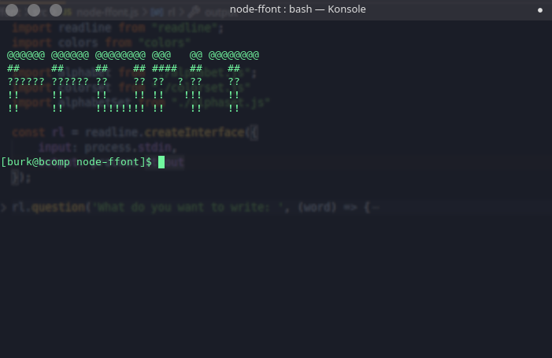
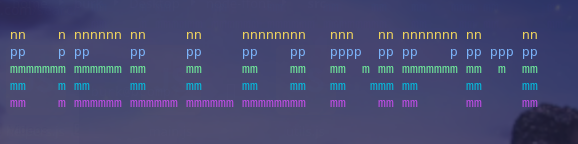

## What is the **node-ffont**?
### node-ffont is the nodejs implementation of [ffont](https://github.com/ferhatgec/ffont/)


## Installation

```bash
$ sudo npm install -g ffont
```

## How to use?

- Write a text with available characters.

## Available Characters
You can see which characters available from src/helpers.js

## Available Colors
"yellow", "blue", "green", "cyan", "magenta", "white", "gray", "grey", "black", "red"


